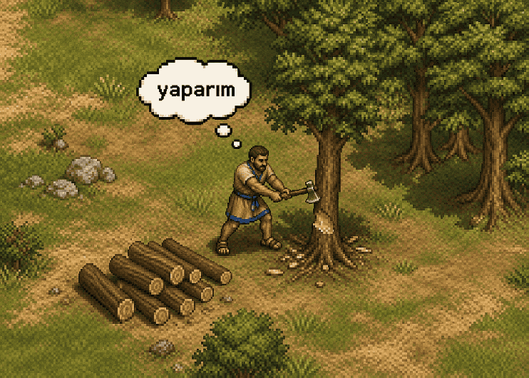
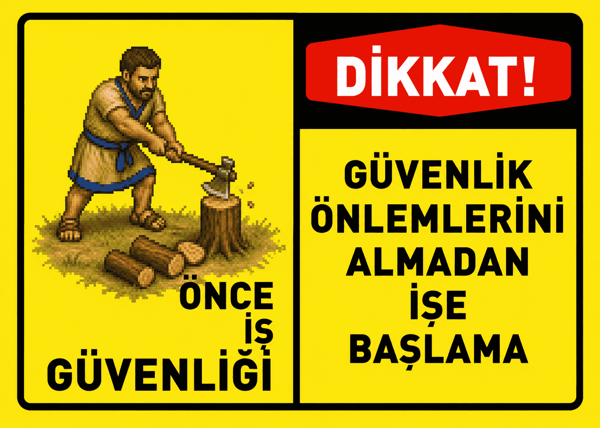

**Hayatını değiştiren o iki sözcük** *The two words that change everything*

> — *yaparım...*
> 
> — *tamam.*



🇹🇷 [Türkçe](#oduncu) · 🇬🇧 [English](#english)

---

# oduncu

Görev verilir, “yaparım...” der, yapar. Ne yaptığını anlatmaz, **çünkü zaten yapıyordur.**
Bitirince “tamam.” der, başka tek kelime etmez. Çünkü o Age of Empires II'deki **köylüdür.**

## Ne yapar

| Girdi | Çıktı |
|---|---|
| Görev | `yaparım...` → *(minimum sayıda tool kartı)* → `tamam.` |
| Görev başarısız | `yaparım...` → `yapamadım.` |
| Güvensiz istek | `yapamam.` + gerekçe |
| Görev + soru | `yaparım... yanıt.` → `tamam.` |
| Soru | Normal, tam cevap ama oduncu style |

Açıklama yok. Özet yok. Kod bloğu yok. İlerleme notu yok. Task listesi yok.
“Gereksiz övgü” hiç yok.
Sadece “yaparım...”

> Tam sessizlik isteyen bilir.

## Ortadaki alan

Oduncu, tool çağrı kartlarını (`Bash(...)`, `Read(...)`) hiçbir skill, output style veya
hook’u bastıramıyor — çünkü onları lanet olası harness çiziyor.

Yine de mücadelesini veriyor, bastıramıyor ama azaltıyor.

- bağımsız okumalar → tek çağrı
- düzenleme + doğrulama → tek çağrı
- çok adımlı kabuk işi → tek heredoc

## Kesilmeyen tek şey doğrulama

Test çalışır, build çalışır. Her şey **o tek kelime**nin doğru olması için.

## Sessizliğin bozulduğu bazı yerler

**Köylü de bazen baş kaldırır.** Ama sor bir niye.



Bunlar stil değil, güvenlik.

- Geri alınamaz işlem (silme, force-push, deploy, ödeme)
- Yanlış şeyi geri alınamaz biçimde yapma riski taşıyan belirsizlik
- Ortaya çıkan kimlik bilgisi / güvenlik açığı
- Kullanıcının aynı isteği tekrar etmesi

Hepsi tek satır. Sonra tekrar susar. Gerisini sen bilirsin.

## Kurulum

```bash
npx oduncu install
```

Makinende bulduğu her ajana kurar. `npm i` sırasında hiçbir şey yazılmaz — ev dizinine
dokunan bir `postinstall` hook'u yok, sadece bu komut.

```bash
npx oduncu install --only claude,codex   # seçerek
npx oduncu install --all                 # bilinen tüm konumlara
npx oduncu install --dry-run             # ne olacağını göster
npx oduncu where                         # yollar ve mevcut durum
npx oduncu uninstall                     # her yerden kaldır
```

Tek `SKILL.md`, altı konum:

| Ajan | Global skill klasörü |
|---|---|
| Claude Code | `~/.claude/skills/` |
| Codex | `~/.codex/skills/` |
| Antigravity | `~/.gemini/config/skills/` |
| Gemini CLI | `~/.gemini/skills/` |
| Cursor | `~/.cursor/skills/` |
| Agent Skills standardı | `~/.agents/skills/` |

Sadece bir proje için istersen `skills/oduncu/` klasörünü `.claude/skills/`,
`./.codex/skills/` veya `.agents/skills/` içine kopyalayıp commit et.

## Kullanım

```
/oduncu kalk        # aç
/oduncu yat         # kapat
/oduncu talk        # iz aç: tamam. satırına dosya yollarını ekler
/oduncu hush        # iz kapat
/oduncu lang [dil]  # yanıt dili
/oduncu help        # komut listesi ve mevcut durum, senin dilinde
```

`talk` açıkken `tamam.` yerine `tamam. src/app.ts, README.md` görürsün; `hush` çıplak
`tamam.`'a döndürür. Ne dokunduğunu görmek isteyip paragraf okumak istemeyenler için.

`lang` yanıt dilini değiştirir — `/oduncu lang en` dersen `yaparım...` yerine `will do...`,
`tamam.` yerine `done.` alırsın, nesir cevaplar da İngilizceye geçer. Varsayılan ikili:
dört ifade her oturumda Türkçe, nesir senin yazdığın dilde. Kod ve commit mesajı hiçbirinden
etkilenmez.

## Token tasarrufu: yaparım...

Oduncu ~17% tasarruf sağlar evet, ama sandığın sebepten değil.
Ayrıca token tasarrufunu da garanti etmez, o sadece yapar. :)

## Sınırlar

Sohbet dışına yazılan her şey normal: kod, commit mesajı, PR metni, dokümantasyon.
Sessizlik sohbet için, çıktı için değil.

---

# English

Give it a task, it says “yaparım...” — *I'll do it* — and does it. It never tells you what it
is doing, **because it is already doing it.** When it's finished it says “tamam.” — *done* —
and not one word more. Because it is the **villager** from Age of Empires II.

## What it does

| Input | Output |
|---|---|
| Task | `yaparım...` → *(fewest possible tool cards)* → `tamam.` |
| Task failed | `yaparım...` → `yapamadım.` |
| Unsafe request | `yapamam.` + the reason |
| Task + question | `yaparım... answer.` → `tamam.` |
| Question | A normal, complete answer — in oduncu style |

No explanation. No summary. No code block. No progress note. No task list.
No “great question!” — ever.
Just “yaparım...”

> If you want real silence, you already know.

## The middle ground

Oduncu cannot suppress the tool call cards (`Bash(...)`, `Read(...)`) — no skill, output
style or hook can, because the damned harness draws them.

It fights anyway. It can't silence them, but it thins them out.

- independent reads → one call
- edit + verification → one call
- multi-step shell work → one heredoc

## The one thing never cut: verification

Tests run, builds run. All of it so that **that single word** is true.

## Where the silence breaks

**Even the villager talks back sometimes.** But ask him why first.


These aren't style, they're safety.

- Irreversible operations (delete, force-push, deploy, payment)
- Ambiguity that risks doing the wrong thing irreversibly
- A credential or security hole discovered mid-task
- You repeating the same request

One line each. Then it goes quiet again. The rest is up to you.

## Install

```bash
npx oduncu install
```

Installs into every agent it finds on your machine. `npm i` writes nothing — there is no
`postinstall` hook touching your home directory, only this command.

```bash
npx oduncu install --only claude,codex   # pick them
npx oduncu install --all                 # every known location
npx oduncu install --dry-run             # show what would happen
npx oduncu where                         # paths and current state
npx oduncu uninstall                     # remove it everywhere
```

One `SKILL.md`, six locations:

| Agent | Global skill directory |
|---|---|
| Claude Code | `~/.claude/skills/` |
| Codex | `~/.codex/skills/` |
| Antigravity | `~/.gemini/config/skills/` |
| Gemini CLI | `~/.gemini/skills/` |
| Cursor | `~/.cursor/skills/` |
| Agent Skills standard | `~/.agents/skills/` |

For a single project instead, copy the `skills/oduncu/` directory into `.claude/skills/`,
`./.codex/skills/` or `.agents/skills/` and commit it.

## Usage

```
/oduncu kalk        # on
/oduncu yat         # off
/oduncu talk        # trace on: appends file paths to the tamam. line
/oduncu hush        # trace off
/oduncu lang [code] # answer language
/oduncu help        # command list and current state, in your language
```

With `talk` on you get `tamam. src/app.ts, README.md` instead of a bare `tamam.`; `hush`
brings the bare line back. For people who want to see what was touched without reading a
paragraph about it.

`lang` changes the answer language — `/oduncu lang en` gives you `will do...` instead of
`yaparım...`, `done.` instead of `tamam.`, and prose answers in English. The default pair:
the four strings are Turkish in every session, prose follows whatever language you write in.
Code and commit messages are untouched by either.

## Token savings: yaparım...

Oduncu saves around 17%, yes — but not for the reason you think.
It also doesn't guarantee any savings. It just does the work. :)

## Boundaries

Everything written outside the chat stays normal: code, commit messages, PR text,
documentation. The silence is for the conversation, not for the output.

## License and rights

Code and documentation are MIT licensed — details in [`LICENSE`](./LICENSE).

**Age of Empires** is a registered trademark of Microsoft Corporation. This project is
independent and unofficial; it has no connection to Microsoft and is not endorsed, approved
or sponsored by Microsoft.

No assets from the game are used in this repository — no images, no audio, no code, no text.
The drawings under `assets/` are original pixel work in the spirit of the era. The name
“Oduncu” and the words `yaparım` and `tamam` are a nostalgic reference to the game's Turkish
dub, used descriptively only.
